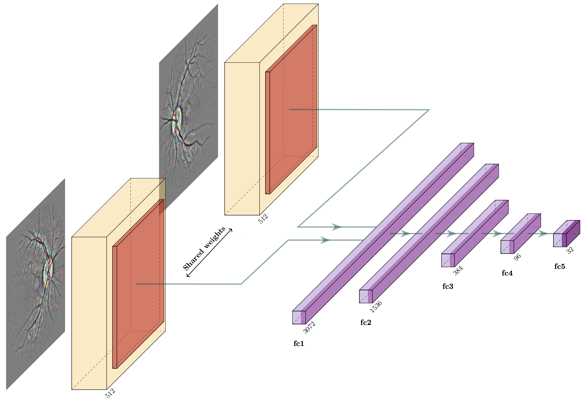
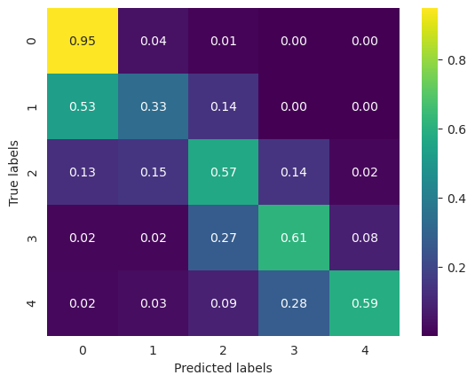

This code was developed for the final degree project at the Universidad Complutense de Madrid by Álvaro Sanz Ramos and Luis Ariza López. The project was supervised by Professor Antonio Alejandro Sánchez Ruiz-Granados. All code is under a MIT licence.

# Diabetic Retinopathy Detection
Diabetic retinopathy (DR) is one of the main complications of diabetes and the leading cause of new cases of blindness. Early detection is fundamental for a good prognosis, but diagnosis is a hard, expensive and time-consuming process. The need of automating methods for DR grading was recognized time ago, but most approaches in literature require vast computational power and have not been designed with interpretability in mind.

We show that a model based in an adapted convolutional neural network from the EfficientNetV2 can achieve excellent performance at DR grading, comparing favorably to much larger models and achieving state-of-the-art results. Using transfer learning, we reduce to the minimum the computational requirements: the model can be trained in a few hours on domestic hardware.

We use the hidden representation learned by the model to identify images diagnostically similar to a given one and explore the possibility of using this model in a clinical setting in a series of test carried on collaboration with a professional ophthalmologist. 

Furthermore, we implement several interpretability tools to understand how the model makes predictions, address important concerns for clinical application (as calibration) and compare our approach to an alternative one using Vision Transformers under strict computational requirements.

# Architecture
The model is built around an EfficientnetV2 backbone and can be repurposed for multiple tasks:

- Feature extraction: using a customized head is possible to extract high quality embeddings for the images. We are already evaluating some uses for this, for example, to implement semantic search.
- Prediction: using a binocular model, we can accurately predict the grade of DR in an image. See the results section for some statistics on precision.

The model has been calibrated using temperature scaling. We also provide multiple visualizations (CAM and GradCAM) to understand the performance of the model.

# Dataset
To reproduce these results you will need to download the EyePACS Dataset from [this Kaggle competition](https://www.kaggle.com/competitions/diabetic-retinopathy-detection/data). Take into account the dataset is around 90GB.

# Weights and results
We can provide weights for the trained model upon request. The results we obtained are:

- Cohen's $\kappa$: 0.8491
- Accuracy: 83.31%

# Estructure of the repository
The structure of the code is the following

- ``lib\preprocess``: contains the code to preprocess the images. The code is based on Ben Graham's strategy for [this Kaggle competition](https://www.kaggle.com/competitions/diabetic-retinopathy-detection) of adding Gaussian noise to the images, but we have adapted it for our use case.
- ``lib\efficientnet``: contains the main CNN definition and the hyperparameters for training.
- ``lib\efficientnet_headed``: contains the definition of an additional head that is useful for extraction of embeddings 
- - ``lib\blending``: contains the definition of an additional head that can be used to generate binocular predictions, using information from left and right eyes at the same time.
- ``lib\model``: contains the code for training, calibrating, and evaluating the model and for generating the predictions.
- ``lib\utilities``: contains utilities code, as well as tools to generate different visualizations, as CAM or GradCAM

# Training a Vision Transformer
We have also fine-tuned [MIL-VT](https://github.com/greentreeys/MIL-VT) from the paper [MIL-VT: Multiple Instance Learning Enhanced Vision Transformer for Fundus Image Classification](https://link.springer.com/chapter/10.1007/978-3-030-87237-3_5).

The module ``lib\transformer``contains the adaptations done to the model so it could be trained efficiently. To use it, it is necessary to download the code from the linked repository.
